# Authentication Architecture Diagram

## Overview

This document presents a comprehensive sequence diagram visualizing the authentication flow for the HealthyMeal application using React, Astro, and Supabase Auth.

## Authentication Analysis

### Authentication Flows

1. **User Registration** - New user signup with email/password
2. **User Login** - Existing user authentication
3. **Protected Route Access** - Token verification for secured endpoints
4. **Token Refresh** - Automatic session renewal
5. **Password Reset** - Email-based password recovery
6. **User Logout** - Session termination

### Actors

- **Browser** - User's web browser
- **Middleware** - Astro middleware (injects Supabase client into context)
- **Astro API** - Server-side API endpoints
- **Supabase Auth** - Supabase authentication service

### Token Management

- Access tokens and refresh tokens stored in cookies
- Cookie names: `sb-access-token`, `sb-refresh-token`, `sb-auth-token`
- Automatic token refresh handled by Supabase SDK
- Session verification via `supabase.auth.getUser()`

---

## Sequence Diagram

```mermaid
sequenceDiagram
    autonumber

    participant Browser
    participant Middleware
    participant API as Astro API
    participant Auth as Supabase Auth

    %% === USER REGISTRATION ===
    rect rgb(100, 149, 237)
    Note over Browser,Auth: User Registration Flow
    end

    Browser->>API: POST /api/auth/register
    API->>Auth: signUp(email, password)

    alt Registration successful
        Auth-->>API: User object + session tokens
        API->>Browser: Set auth cookies
        API-->>Browser: 200 OK (user created)
        Browser->>Browser: Redirect to dashboard
    else Registration failed
        Auth-->>API: Error (email exists, weak password)
        API-->>Browser: 400 Bad Request (error message)
        Browser->>Browser: Display error message
    end

    %% === USER LOGIN ===
    rect rgb(210, 105, 30)
    Note over Browser,Auth: User Login Flow
    end

    Browser->>API: POST /api/auth/login
    API->>Auth: signInWithPassword(email, password)

    alt Login successful
        Auth-->>API: User object + session tokens
        API->>Browser: Set auth cookies
        Note right of Browser: sb-access-token<br/>sb-refresh-token
        API-->>Browser: 200 OK (login success)
        Browser->>Browser: Redirect to home page
    else Login failed
        Auth-->>API: Error (invalid credentials)
        API-->>Browser: 401 Unauthorized
        Browser->>Browser: Display error message
    end

    %% === PROTECTED ROUTE ACCESS ===
    rect rgb(60, 179, 113)
    Note over Browser,Auth: Protected Route Access
    end

    Browser->>Middleware: Request protected resource
    Middleware->>Middleware: Inject Supabase client
    Middleware->>API: Forward request with context

    API->>Auth: getUser() - verify token

    alt Token valid
        Auth-->>API: User data
        API->>API: Process request
        API-->>Browser: 200 OK (data)
    else Token expired
        Auth-->>API: Token expired error
        Note over API,Auth: Attempt token refresh
        API->>Auth: refreshSession()

        alt Refresh successful
            Auth-->>API: New tokens
            API->>Browser: Set new auth cookies
            API->>API: Retry original request
            API-->>Browser: 200 OK (data)
        else Refresh failed
            Auth-->>API: Invalid refresh token
            API-->>Browser: 401 Unauthorized
            Browser->>Browser: Redirect to login
        end
    else No token present
        Auth-->>API: Unauthorized
        API-->>Browser: 401 Unauthorized
        Browser->>Browser: Redirect to login
    end

    %% === PASSWORD RESET ===
    rect rgb(218, 165, 32)
    Note over Browser,Auth: Password Reset Flow
    end

    Browser->>API: POST /api/auth/reset-password
    API->>Auth: resetPasswordForEmail(email)
    Auth->>Auth: Generate reset token
    Auth-->>API: Email sent confirmation
    API-->>Browser: 200 OK (check email)

    Note over Browser: User clicks email link

    Browser->>API: POST /api/auth/update-password
    API->>Auth: updateUser(new_password)

    alt Update successful
        Auth-->>API: Password updated
        API-->>Browser: 200 OK (password changed)
        Browser->>Browser: Redirect to login
    else Update failed
        Auth-->>API: Error (weak password, expired link)
        API-->>Browser: 400 Bad Request
        Browser->>Browser: Display error message
    end

    %% === USER LOGOUT ===
    rect rgb(199, 21, 133)
    Note over Browser,Auth: User Logout Flow
    end

    Browser->>API: POST /api/auth/logout
    API->>Auth: signOut()
    Auth-->>API: Sign out confirmation

    API->>Browser: Clear auth cookies
    Note right of Browser: Delete:<br/>sb-access-token<br/>sb-refresh-token<br/>sb-auth-token

    API-->>Browser: 200 OK (logged out)
    Browser->>Browser: Redirect to login page

    %% === AUTOMATIC TOKEN REFRESH ===
    rect rgb(138, 43, 226)
    Note over Browser,Auth: Automatic Token Refresh
    end

    Browser->>API: Request with expiring token
    API->>Auth: getUser() - token near expiry
    Auth->>Auth: Check token expiration
    Auth-->>API: Token valid but near expiry

    API->>Auth: refreshSession()
    Auth-->>API: New access token
    API->>Browser: Set new auth cookies
    API->>API: Process request
    API-->>Browser: 200 OK (data)
```

---

## Flow Descriptions

### 1. User Registration
- User submits email and password to registration endpoint
- Supabase Auth creates new user account
- On success: session tokens returned and stored in cookies
- User automatically logged in and redirected to dashboard

### 2. User Login
- User submits credentials to login endpoint
- Supabase Auth validates credentials
- On success: access and refresh tokens set in cookies
- User redirected to home page

### 3. Protected Route Access
- All requests pass through Astro middleware
- Middleware injects Supabase client into request context
- API endpoints call `getUser()` to verify authentication
- Invalid/expired tokens trigger refresh attempt or redirect to login

### 4. Token Refresh
- Supabase SDK handles automatic token refresh
- Refresh occurs when access token is near expiry
- New tokens set in cookies transparently
- Failed refresh results in logout

### 5. Password Reset
- User requests password reset email
- Supabase sends email with reset link containing token
- User clicks link and submits new password
- Token validated and password updated

### 6. User Logout
- Browser calls logout API endpoint
- Supabase Auth invalidates session server-side
- All auth cookies cleared
- User redirected to login page

---

## Security Considerations

- **HTTPOnly Cookies**: Auth tokens stored in HTTPOnly cookies prevent XSS attacks
- **Token Expiration**: Short-lived access tokens (default 1 hour) minimize risk
- **Refresh Token Rotation**: New refresh token issued with each refresh
- **Server-side Validation**: All token verification happens server-side via Supabase
- **CSRF Protection**: Astro's built-in protections for form submissions
