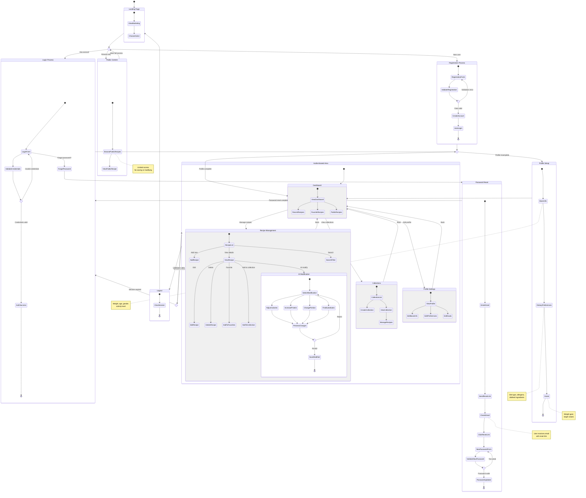

# User Journey Diagram

## Overview

This document presents a state diagram visualizing user journeys through the HealthyMeal application, focusing on authentication, onboarding, and core functionality access.

## User Journey Analysis

### User Paths

1. **New User Journey**
   - Landing page → Register → Profile setup → Dashboard → Use app

2. **Returning User Journey**
   - Landing page → Login → Dashboard → Use app

3. **Password Recovery Journey**
   - Login page → Forgot password → Check email → Reset password → Login

4. **Unauthenticated User Journey**
   - Landing page → View public content only

5. **Authenticated User Journey**
   - Dashboard → Manage recipes → Modify with AI → Organize collections

### Main States

- **Landing Page** - Entry point, marketing content
- **Login** - Authentication for existing users
- **Registration** - Account creation for new users
- **Password Reset** - Recovery flow for forgotten passwords
- **Dashboard** - Main hub after authentication
- **Profile Setup** - User preferences and dietary goals
- **Recipe Management** - Core functionality

### Decision Points

- User has account? → Login or Register
- Credentials valid? → Success or Error
- Profile complete? → Dashboard or Setup
- Session valid? → Continue or Re-authenticate

---

## State Diagram

---

## Journey Descriptions

### 1. New User Onboarding
New users arrive at the landing page, register with email/password, and are automatically logged in. They're then guided through profile setup where they enter basic information, dietary preferences, and goals. After setup, they land on the personalized dashboard.

### 2. Returning User Access
Existing users go directly to login, enter credentials, and access their dashboard. If their session is still valid, they may skip login entirely.

### 3. Password Recovery
Users who forgot their password can request a reset link via email. After clicking the link, they set a new password and return to login.

### 4. Core App Usage
Authenticated users can:
- **Browse recipes** - View, search, and filter their recipe collection
- **Add recipes** - Create new recipes with ingredients and steps
- **Modify with AI** - Adjust calories, protein, portions, or find substitutes
- **Organize** - Add to favorites or custom collections
- **Manage profile** - Update preferences and goals

### 5. Session Management
The app checks session validity on protected routes. Expired sessions redirect to login while preserving the intended destination.

---

## Key User Stories Covered

| User Story | Journey Coverage |
|------------|------------------|
| US-001: Registration | Registration Process → Auto Login → Profile Setup |
| US-002: Login | Login Process → Dashboard |
| US-003: Password Reset | Password Reset flow |
| US-004: Logout | Logout → Landing Page |
| US-005-008: Profile | Profile Setup composite state |
| US-009-016: Recipes | Recipe Management composite state |
| US-017-020: AI Modify | AI Modification nested state |
| US-028: Dashboard | Dashboard state with sections |
