# UI Components Architecture Diagram

## Overview

This document presents a flowchart visualizing the architecture of Astro pages and React components for the HealthyMeal application, with focus on the authentication module integration.

## Architecture Analysis

### Component Categories

1. **Layouts (Astro)** - Base templates for page structure
2. **Pages (Astro)** - Server-rendered routes
3. **React Components** - Interactive UI elements
4. **Custom Hooks** - Shared state and data fetching logic
5. **UI Library** - Shadcn/ui base components

### Current Components

**Existing:**
- AppLayout for authenticated pages
- Layout for landing page
- Dashboard, Recipes, Collections, Favorites, Profile pages
- Full recipe management components
- Profile settings components

**Missing (To Be Added):**
- Auth pages (Login, Register, Reset Password)
- Auth form components
- Auth-specific layout

### Data Flow Patterns

1. **Server → Client**: Astro pages fetch data, pass as props to React
2. **Client State**: React hooks manage local and API state
3. **API Calls**: Custom hooks fetch from `/api/*` endpoints
4. **Auth Context**: User info passed through layouts

---

## Architecture Diagram

```mermaid
flowchart TD
    %% Define styles
    classDef layout fill:#6366f1,stroke:#4338ca,color:#fff
    classDef newComponent fill:#f97316,stroke:#c2410c,color:#fff
    classDef page fill:#3b82f6,stroke:#1d4ed8,color:#fff
    classDef component fill:#10b981,stroke:#047857,color:#fff
    classDef hook fill:#8b5cf6,stroke:#6d28d9,color:#fff
    classDef api fill:#64748b,stroke:#334155,color:#fff

    %% ===== LAYOUTS =====
    subgraph Layouts["Layouts"]
        Layout["Layout.astro<br/>Public Pages"]:::layout
        AppLayout["AppLayout.astro<br/>Authenticated Pages"]:::layout
        AuthLayout["AuthLayout.astro<br/>Auth Pages"]:::newComponent
    end

    %% ===== AUTH PAGES =====
    subgraph AuthPages["Auth Pages (New)"]
        LoginPage["login.astro"]:::newComponent
        RegisterPage["register.astro"]:::newComponent
        ResetPwdPage["reset-password.astro"]:::newComponent
        NewPwdPage["reset-password/token.astro"]:::newComponent
    end

    %% ===== APP PAGES =====
    subgraph AppPages["App Pages"]
        DashboardPage["dashboard.astro"]:::page
        RecipesPage["recipes.astro"]:::page
        RecipeDetailPage["recipes/id.astro"]:::page
        RecipeNewPage["recipes/new.astro"]:::page
        RecipeEditPage["recipes/id/edit.astro"]:::page
        PublicRecipesPage["recipes/public.astro"]:::page
        FavoritesPage["favorites.astro"]:::page
        CollectionsPage["collections.astro"]:::page
        CollectionDetailPage["collections/id.astro"]:::page
        ProfilePage["profile.astro"]:::page
    end

    %% ===== LANDING PAGE =====
    subgraph LandingPage["Landing Page"]
        IndexPage["index.astro"]:::page
    end

    %% Layout connections
    Layout --> IndexPage
    AuthLayout --> AuthPages
    AppLayout --> AppPages

    %% ===== AUTH COMPONENTS =====
    subgraph AuthComponents["Auth Components (New)"]
        LoginForm["LoginForm"]:::newComponent
        RegisterForm["RegisterForm"]:::newComponent
        ResetPwdForm["ResetPasswordForm"]:::newComponent
        NewPwdForm["NewPasswordForm"]:::newComponent
    end

    %% Auth page to component connections
    LoginPage --> LoginForm
    RegisterPage --> RegisterForm
    ResetPwdPage --> ResetPwdForm
    NewPwdPage --> NewPwdForm

    %% ===== APP SHELL COMPONENTS =====
    subgraph AppShell["App Shell"]
        AppHeader["AppHeader.astro"]:::component
        UserMenu["UserMenu"]:::component
        MobileNav["MobileNav"]:::component
    end

    AppLayout --> AppHeader
    AppHeader --> UserMenu
    AppHeader --> MobileNav

    %% ===== DASHBOARD COMPONENTS =====
    subgraph DashboardComponents["Dashboard Components"]
        WelcomeBanner["WelcomeBanner"]:::component
        DashboardContent["DashboardContent"]:::component
        RecipeSectionRow["RecipeSectionRow"]:::component
        RecipeCard["RecipeCard"]:::component
    end

    DashboardPage --> WelcomeBanner
    DashboardPage --> DashboardContent
    DashboardContent --> RecipeSectionRow
    RecipeSectionRow --> RecipeCard

    %% ===== RECIPE LIST COMPONENTS =====
    subgraph RecipeListComponents["Recipe List Components"]
        RecipeListLayout["RecipeListLayout"]:::component
        SearchBar["SearchBar"]:::component
        FilterPanel["FilterPanel"]:::component
        ActiveFilterChips["ActiveFilterChips"]:::component
        RecipeGrid["RecipeGrid"]:::component
        Pagination["Pagination"]:::component
    end

    RecipesPage --> RecipeListLayout
    PublicRecipesPage --> RecipeListLayout
    RecipeListLayout --> SearchBar
    RecipeListLayout --> FilterPanel
    RecipeListLayout --> ActiveFilterChips
    RecipeListLayout --> RecipeGrid
    RecipeListLayout --> Pagination
    RecipeGrid --> RecipeCard

    %% ===== RECIPE DETAIL COMPONENTS =====
    subgraph RecipeDetailComponents["Recipe Detail Components"]
        RecipeDetailLayout["RecipeDetailLayout"]:::component
        RecipeHeader["RecipeHeader"]:::component
        IngredientsList["IngredientsList"]:::component
        PreparationSteps["PreparationSteps"]:::component
        NutritionCard["NutritionCard"]:::component
        ActionButtons["ActionButtons"]:::component
        ModifyWithAI["ModifyWithAIModal"]:::component
        AddToCollection["AddToCollectionDialog"]:::component
    end

    RecipeDetailPage --> RecipeDetailLayout
    RecipeDetailLayout --> RecipeHeader
    RecipeDetailLayout --> IngredientsList
    RecipeDetailLayout --> PreparationSteps
    RecipeDetailLayout --> NutritionCard
    RecipeDetailLayout --> ActionButtons
    ActionButtons --> ModifyWithAI
    ActionButtons --> AddToCollection

    %% ===== RECIPE WIZARD COMPONENTS =====
    subgraph RecipeWizardComponents["Recipe Wizard Components"]
        RecipeFormWizard["RecipeFormWizard"]:::component
        ProgressIndicator["ProgressIndicator"]:::component
        BasicInfoStep["BasicInfoStep"]:::component
        IngredientsStep["IngredientsStep"]:::component
        StepsStep["StepsStep"]:::component
        NutritionStep["NutritionStep"]:::component
        TagsStep["TagsStep"]:::component
        ReviewStep["ReviewStep"]:::component
    end

    RecipeNewPage --> RecipeFormWizard
    RecipeEditPage --> RecipeFormWizard
    RecipeFormWizard --> ProgressIndicator
    RecipeFormWizard --> BasicInfoStep
    RecipeFormWizard --> IngredientsStep
    RecipeFormWizard --> StepsStep
    RecipeFormWizard --> NutritionStep
    RecipeFormWizard --> TagsStep
    RecipeFormWizard --> ReviewStep

    %% ===== COLLECTIONS COMPONENTS =====
    subgraph CollectionsComponents["Collections Components"]
        CollectionsLayout["CollectionsLayout"]:::component
        CollectionGrid["CollectionGrid"]:::component
        CollectionCard["CollectionCard"]:::component
        CollectionDetailLayout["CollectionDetailLayout"]:::component
        CollectionHeader["CollectionHeader"]:::component
    end

    CollectionsPage --> CollectionsLayout
    CollectionsLayout --> CollectionGrid
    CollectionGrid --> CollectionCard
    CollectionDetailPage --> CollectionDetailLayout
    CollectionDetailLayout --> CollectionHeader

    %% ===== FAVORITES COMPONENTS =====
    subgraph FavoritesComponents["Favorites Components"]
        FavoritesLayout["FavoritesLayout"]:::component
        EmptyFavoritesState["EmptyFavoritesState"]:::component
    end

    FavoritesPage --> FavoritesLayout
    FavoritesLayout --> RecipeGrid
    FavoritesLayout --> EmptyFavoritesState

    %% ===== PROFILE COMPONENTS =====
    subgraph ProfileComponents["Profile Components"]
        ProfileSettingsLayout["ProfileSettingsLayout"]:::component
        SettingsSidebar["SettingsSidebar"]:::component
        BasicInfoSection["BasicInfoSection"]:::component
        DietaryPrefsSection["DietaryPreferencesSection"]:::component
        AllergensSection["AllergensSection"]:::component
    end

    ProfilePage --> ProfileSettingsLayout
    ProfileSettingsLayout --> SettingsSidebar
    ProfileSettingsLayout --> BasicInfoSection
    ProfileSettingsLayout --> DietaryPrefsSection
    ProfileSettingsLayout --> AllergensSection

    %% ===== CUSTOM HOOKS =====
    subgraph CustomHooks["Custom Hooks"]
        useRecipeList["useRecipeList"]:::hook
        useRecipeDetail["useRecipeDetail"]:::hook
        useRecipeFilters["useRecipeFilters"]:::hook
        useFavorites["useFavorites"]:::hook
        useFavoriteToggle["useFavoriteToggle"]:::hook
        useCollectionDetail["useCollectionDetail"]:::hook
        useProfileSettings["useProfileSettings"]:::hook
        useTags["useTags"]:::hook
    end

    %% Hook connections
    RecipeListLayout -.-> useRecipeList
    RecipeListLayout -.-> useRecipeFilters
    RecipeDetailLayout -.-> useRecipeDetail
    FavoritesLayout -.-> useFavorites
    RecipeCard -.-> useFavoriteToggle
    CollectionDetailLayout -.-> useCollectionDetail
    ProfileSettingsLayout -.-> useProfileSettings
    FilterPanel -.-> useTags

    %% ===== API LAYER =====
    subgraph APILayer["API Endpoints"]
        AuthAPI["Auth API<br/>/api/auth/*"]:::api
        RecipesAPI["Recipes API<br/>/api/recipes/*"]:::api
        CollectionsAPI["Collections API<br/>/api/collections/*"]:::api
        ProfileAPI["Profile API<br/>/api/profile"]:::api
        FavoritesAPI["Favorites API<br/>/api/favorites/*"]:::api
    end

    %% API connections
    LoginForm -.-> AuthAPI
    RegisterForm -.-> AuthAPI
    ResetPwdForm -.-> AuthAPI
    UserMenu -.-> AuthAPI
    useRecipeList -.-> RecipesAPI
    useRecipeDetail -.-> RecipesAPI
    useCollectionDetail -.-> CollectionsAPI
    useProfileSettings -.-> ProfileAPI
    useFavorites -.-> FavoritesAPI

    %% ===== LANDING COMPONENTS =====
    subgraph LandingComponents["Landing Components"]
        LandingHeader["LandingHeader"]:::component
        HeroSection["HeroSection"]:::component
        FeaturesSection["FeaturesSection"]:::component
        Footer["Footer"]:::component
    end

    IndexPage --> LandingHeader
    IndexPage --> HeroSection
    IndexPage --> FeaturesSection
    IndexPage --> Footer
```



---

## Component Descriptions

### New Auth Components (Highlighted in Orange)

| Component | Description |
|-----------|-------------|
| **AuthLayout.astro** | Astro layout for auth pages with minimal UI, centered forms |
| **LoginForm** | Email/password form with validation, error handling |
| **RegisterForm** | Registration form with password requirements |
| **ResetPasswordForm** | Email input to request password reset |
| **NewPasswordForm** | Set new password after clicking email link |

### Layout Components

| Component | Description |
|-----------|-------------|
| **Layout.astro** | Base layout for landing/public pages |
| **AppLayout.astro** | Authenticated app layout with header, navigation |

### App Shell Components

| Component | Description |
|-----------|-------------|
| **AppHeader.astro** | Main navigation bar with logo, nav links |
| **UserMenu** | User dropdown with profile, settings, logout |
| **MobileNav** | Mobile navigation drawer |

### Custom Hooks

| Hook | Purpose |
|------|---------|
| **useRecipeList** | Fetch and manage recipe list with pagination |
| **useRecipeDetail** | Fetch single recipe with modifications |
| **useRecipeFilters** | Manage filter state and URL sync |
| **useFavorites** | Fetch user's favorite recipes |
| **useFavoriteToggle** | Toggle favorite status on recipe |
| **useCollectionDetail** | Fetch collection with recipes |
| **useProfileSettings** | Manage profile form state |
| **useTags** | Fetch available recipe tags |

---

## Auth Integration Points

### 1. Layout Level
- **AppLayout** checks authentication, redirects to login if needed
- **AuthLayout** redirects to dashboard if already authenticated

### 2. API Level
- All `/api/*` endpoints verify user token via middleware
- Auth endpoints handle login, register, logout, password reset

### 3. Component Level
- **UserMenu** handles logout action
- **AppHeader** shows different UI for authenticated vs unauthenticated

### 4. Middleware Level
- Injects Supabase client into `context.locals`
- Verifies tokens for protected routes

---

## File Structure Summary

```
src/
├── layouts/
│   ├── Layout.astro           (public)
│   ├── AppLayout.astro        (authenticated)
│   └── AuthLayout.astro       (NEW - auth forms)
├── pages/
│   ├── index.astro            (landing)
│   ├── login.astro            (NEW)
│   ├── register.astro         (NEW)
│   ├── reset-password.astro   (NEW)
│   ├── dashboard.astro
│   ├── recipes/...
│   ├── collections/...
│   ├── favorites.astro
│   └── profile.astro
├── components/
│   ├── auth/                  (NEW)
│   │   ├── LoginForm.tsx
│   │   ├── RegisterForm.tsx
│   │   ├── ResetPasswordForm.tsx
│   │   └── NewPasswordForm.tsx
│   ├── app/
│   ├── recipes/
│   ├── collections/
│   ├── favorites/
│   ├── profile/
│   ├── hooks/
│   └── ui/
└── middleware/
    └── index.ts
```
